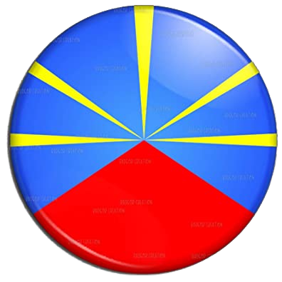

<h1 align="center">
      
    Map management application to register and list 3D printers fighting against COVID-19 thanks to 3D printing
</h1>

<h4 align="center">
Made with <a href="https://github.com/gatsbyjs/gatsby" target="_blank">Gatsby</a> to make it ultralight and blazing fast .
</h4>

## Why Gatsby

The first answer is why not? My goal was to discover this framework as we can hear about it everywhere. The application I wanted to build was the perfect match because I didn't need to use a backend thanks to Google Firebase API.
I ran into a lot of headache to manage a correct production build but the game was worthing the cost. This tool is amazing. The learning curve is anyway quite tougher and dealing with some React tricks didn't made the game easier. But my conclusion is that Gatsby is a very amazing tool and not so difficult to use after all.

## Project technologies

- a complete SPA and PWA compatible frontend built with Gatsby, material UI and some other plugins
- managed database provided by Google firestore
- Firestore authentication API
- leaflet and openstreetmap for map API

## License

The MIT License (MIT)

Copyright (c) 2020 Rudy GRONDIN

Permission is hereby granted, free of charge, to any person obtaining a copy of this software and associated documentation files (the "Software"), to deal in the Software without restriction, including without limitation the rights to use, copy, modify, merge, publish, distribute, sublicense, and/or sell copies of the Software, and to permit persons to whom the Software is furnished to do so, subject to the following conditions:

The above copyright notice and this permission notice shall be included in all copies or substantial portions of the Software.

THE SOFTWARE IS PROVIDED "AS IS", WITHOUT WARRANTY OF ANY KIND, EXPRESS OR IMPLIED, INCLUDING BUT NOT LIMITED TO THE WARRANTIES OF MERCHANTABILITY, FITNESS FOR A PARTICULAR PURPOSE AND NONINFRINGEMENT. IN NO EVENT SHALL THE AUTHORS OR COPYRIGHT HOLDERS BE LIABLE FOR ANY CLAIM, DAMAGES OR OTHER LIABILITY, WHETHER IN AN ACTION OF CONTRACT, TORT OR OTHERWISE, ARISING FROM, OUT OF OR IN CONNECTION WITH THE SOFTWARE OR THE USE OR OTHER DEALINGS IN THE SOFTWARE.
